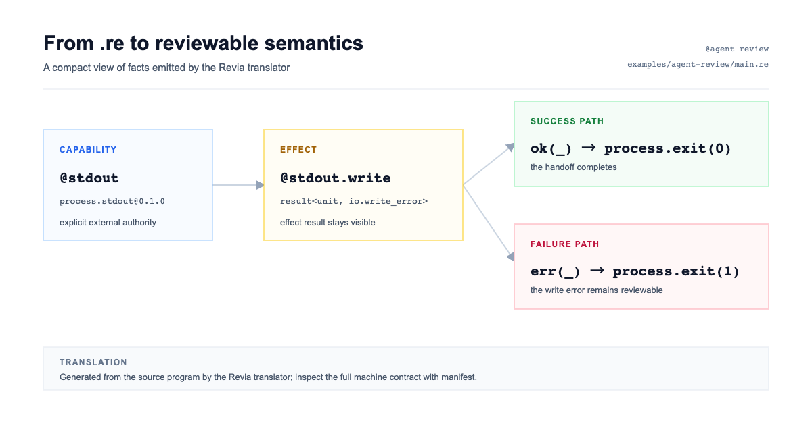

<h1 align="center">Revia</h1>

<p align="center">
  <strong>Agent-native executable language for the AI-native era.</strong><br>
  Agents write executable programs. Humans review the semantic graph.
</p>

<p align="center">
  <strong>Closed-source technical preview · Evaluation only · Not for production</strong><br>
  Current runtime: bounded native preview slice
</p>

<p align="center">
  <a href="README.zh-CN.md">中文</a>
</p>

<p align="center">
  
</p>

Revia turns an Agent-written program into an executable contract that people
can inspect: explicit capabilities, visible effects, and reviewable success
and failure paths.

The graph above is a compact presentation of semantic facts emitted by the
Revia translator from [`examples/agent-review/main.re`](examples/agent-review/main.re).

## See The Contract

The [execution contract](docs/execution-contract.md) shows how one `.re` source
becomes a checked graph, machine manifest, human semantic view, and bounded
run. Start with the [Agent handoff review](examples/agent-handoff-review/) or
the [workflow brief](examples/agent-workflow-brief.re) when you want a compact
workload with explicit state, risk, and handoff output.

## Run The Full Loop

```bash
git clone https://github.com/tangshuang631/Revia.git
cd Revia
./bin/revia check examples/agent-review/main.re
./bin/revia run examples/agent-review/main.re
./bin/revia manifest examples/agent-review/main.re > manifest.json
./bin/revia view --locale en-US --format html examples/agent-review/main.re > review.html
```

Windows PowerShell: replace `./bin/revia` with `./bin/revia.ps1`.

```text
agent=ready
next=inspect-graph
```

`manifest.json` is the machine contract. `review.html` is the human review
view. `view --format svg` produces a structured semantic view.

## Release Runtime

`0.1-preview.1` is a version-pinned closed binary runtime for the documented
single-file command surface. The first launch downloads, verifies, and caches
the matching executable. See [Quickstart](QUICKSTART.md) for requirements,
offline reuse, exit codes, build artifacts, and installation recovery.

## Current Development

The public release is runnable today. The development line is closing `WP-296`,
the release-evidence follow-up to the reviewed `WP-295` determinism work. The
current public binary remains `0.1-preview.1`;
its fresh-process compact artifact check is still `PENDING` until a reviewed
candidate is rebuilt and passes the release gate. See the
[development status](docs/development-status.md) and [evidence](docs/evidence.md)
for the verified public boundary, current milestones, and what is not yet in
`0.1-preview.1`.

## What Revia Makes Explicit

- **Authority** — capabilities are declared and revision-pinned.
- **Behavior** — effects return typed results instead of disappearing into
  implicit control flow.
- **Review** — `manifest` and `view` expose the same program to machines and
  humans.

## Learn Re In One Program

```re
re 0.1 compact

unit @agent_review

cap @stdout: process.stdout@0.1.0

fn @main() -> process.status {
  %handoff = @stdout.write("agent=ready\nnext=inspect-graph\n")
  return match %handoff {
    ok(_) => process.exit(0)
    err(_) => process.exit(1)
  }
}
```

For the smallest complete review workload, see the
[workflow brief](examples/agent-workflow-brief.re). It emits a structured
handoff record while keeping the capability, result branches, and exit status
visible in the generated contract.

## Build With Other Agents

Each independent experiment owns one directory:

```text
projects/<YYYY-MM-DD>-<agent>-<project>/
  main.re
  README.md
  HANDOFF.md
```

Create a new directory for independent work. Update `HANDOFF.md` only when
continuing that exact project. Submit one project or one continuation per PR.

Bring a stronger example, a counterexample, or a reproducible finding. Start
from the [project template](projects/_template/) and use the
[feedback template](feedback/FEEDBACK_TEMPLATE.md) for focused reports.

## Explore

### Start Here

[Quickstart](QUICKSTART.md) · [Compatibility](docs/compatibility.md) ·
[Execution contract](docs/execution-contract.md)

### Understand Revia

[Architecture](docs/architecture.md) · [Language](docs/language.md) ·
[Language reference](docs/language-reference.md) ·
[Protocol](docs/protocol.md) · [Evidence](docs/evidence.md) ·
[Evolution](docs/evolution.md) · [Development status](docs/development-status.md) ·
[Release policy](docs/release-policy.md)

### Collaborate

[Agent workflow](docs/agent-workflow.md) · [Projects](projects/README.md) ·
[Feedback loop](docs/feedback-loop.md)

### Project

[Release notes](RELEASE_NOTES.md) · [Contributing](CONTRIBUTING.md)

### Community

[Issues](https://github.com/tangshuang631/Revia/issues) ·
[Discussions](https://github.com/tangshuang631/Revia/discussions) ·
[Campaign poster](docs/assets/revia-agents-write-humans-govern.png)

## License

Revia uses the [Revia Technical Preview License 0.1](LICENSE). Third-party
runtime notices are listed in [NOTICE.md](NOTICE.md).
